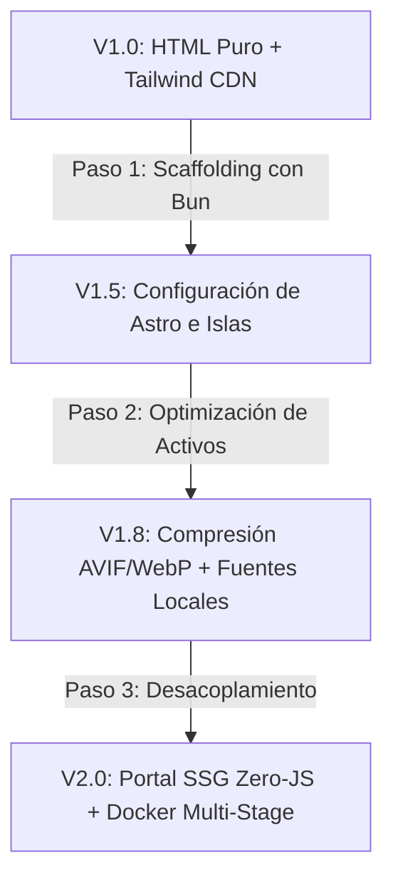

# 🚀 Portal Web Institucional - Colegio Johan Kepler (Soyapango)

## 📋 Proyecto de Servicio Social Universitario
### 🎓 Técnico Superior Universitario en Servicios en la Nube | ESIT

---
### 🛡️ Estado de Infraestructura Actual vs. Objetivo
  

---

> [!IMPORTANT]
> **AUDITORÍA TÉCNICA DE LAVERSIÓN ACTUAL (V1.0-LEGACY):**
> 
> El repositorio contiene actualmente un despliegue estático monolítico basado en HTML5 puro maquetado con **Tailwind CSS vía CDN** y servido mediante un contenedor optimizado de **Nginx Alpine**. Este documento establece la radiografía del código base real subido y traza la ruta crítica de refactorización hacia la arquitectura desacoplada de alto rendimiento (Astro + Bun + Solid.js) dictada por la constitución de nuestro `Digital_Brain`.

---

## 🏫 1. Diagnóstico del Dominio e Identidad Territorial

El **Colegio Johan Kepler** requiere una plataforma web diseñada para la realidad socioeconómica y de conectividad de **Soyapango**. El diseño visual implementado en `index.html` ya refleja de forma exitosa los pilares del negocio educativo:

1. **Flexibilidad frente al Polo Industrial:** Se destaca la sección de *Horario Adaptado para la familia trabajadora* (Lunes a Jueves 06:00 - 15:00, Viernes de consulta hasta las 17:00), respondiendo al entorno manufacturero y logístico del municipio.
2. **Cumplimiento Curricular Completo:** Visibilidad explícita de los programas del Ministerio de Educación (MINED): **ESMATE** (con sus 192 indicadores de logro) y **ESLENGUA** para la preparación de la prueba **AVANZO**.
3. **Internacionalización y Acceso:** Mapeo conceptual del acceso al sistema **SIRAI** y el lema institucional *"Calidad Internacional a Valor Local"*.

---

## 🏗️ 2. Arquitectura de Software Actual (V1.0) y Deuda Técnica

El código actual está diseñado bajo un modelo de contingencia ligero, pero introduce elementos de bloqueo que contravienen las reglas del `01_manifiesto_core.md`:

### Desglose de Componentes Existentes:
* **`index.html` (Capa de Presentación):** Utiliza Tailwind CSS inyectado por script de cliente (`https://cdn.tailwindcss.com`). Esto obliga al navegador a parsear y compilar los estilos en tiempo de ejecución, destruyendo el rendimiento en dispositivos móviles de gama baja. Las fuentes se cargan desde Google Fonts de forma síncrona.
* **`assets/` (Multimedia):** Contiene `logo.png` y `fachada.jpg`. Las imágenes están en formatos crudos (PNG/JPG) sin compresión moderna ni variantes adaptativas.
* **`Dockerfile` (Contenedorización):** Construcción correcta basada en `nginx:1.25-alpine`. Implementa buenas prácticas de seguridad perimetral mediante la reasignación de permisos (`chown -R nginx:nginx` y `chmod 755`), garantizando que el servidor web corra sin privilegios de root.
* **`docker-compose.yml` (Orquestación Local):** Aplica límites estrictos de control de recursos (FinOps) asignando un máximo de `0.1 CPUs` y `50M de memoria RAM`. 

  > [!WARNING]
  > **Restricción de Red en Compose:** El archivo bindea explícitamente el puerto a la IP estática `192.168.1.90:8080:80`. Esto causará un fallo de inicialización (`bind: cannot assign requested address`) en entornos de desarrollo cuyas interfaces de red locales no coincidan con ese segmento.

---

## 🚀 3. Inicialización y Despliegue de la Versión Actual

Para ejecutar el contenedor demo tal y como está estructurado en tu entorno local (WSL2 / Linux Alpine):

### Opción A: Despliegue con Docker Compose (Entorno Controlado)
Si tu máquina local está mapeada en el segmento de red configurado:
```bash
# Levantar el contenedor en segundo plano
docker compose up -d

# Verificar consumo milimétrico (Control de Cuotas del Manifiesto)
docker stats kepler_institutional_demo
```

### Opción B: Despliegue Agnóstico (Ignorando Hardcoding de IP)
Para validar el sitio en cualquier máquina de desarrollo sin colisiones de interfaz:
```bash
# Construir la imagen local respetando el multi-stage
docker build -t johan-kepler:legacy .

# Correr exponiendo el puerto de forma global en localhost
docker run -d -p 8080:80 --name kepler_demo johan-kepler:legacy
```
El portal estará disponible inmediatamente en `http://localhost:8080`.

---

## 🗺️ 4. Roadmap de Refactorización: Hacia la Célula V2.0 (Astro + Bun)

Para dar cumplimiento al Servicio Social con estándares de ingeniería de software de nivel empresarial, se ejecutará la migración dividida en los siguientes hitos técnicos:



### 📋 Acciones Técnicas Inmediatas:
- [ ] **Eliminar el CDN de Tailwind:** Configurar el compilador estático de Astro para que realice el purgado de clases CSS en tiempo de compilación (*build time*), enviando un archivo minificado plano al cliente.
- [ ] **Procesamiento de Imágenes (`<picture>`):** Pasar `fachada.jpg` y `logo.png` por la capa de optimización para generar fallbacks en `.avif` y `.webp`, reduciendo el peso de transferencia en un 75%.
- [ ] **Desacoplar Variables de Entorno:** Eliminar la IP hardcodeada del `docker-compose.yml` y parametrizarla mediante un archivo `.env` efímero controlado por RAM, alineado a la seguridad Zero-Trust.
- [ ] **Estructurar Componentes:** Fragmentar el `index.html` en archivos limpios dentro de Astro: `Navbar.astro`, `Hero.astro`, `Schedules.astro`, y `Footer.astro`.

---

## 🧠 5. Control de Persistencia y Gobernanza de Datos

El portal legacy actual no procesa persistencia (el acceso a SIRAI es un botón externo). Sin embargo, el diseño del módulo de admisiones y pre-matrícula en línea para los Bachilleratos Técnicos requerirá una capa de datos robusta, soberana y eficiente en hardware local.

---
> ### **Trazabilidad de Servicio Social:** 
> 
> Código bajo control del Propietario del Repositorio: **Rickelmy Cubías** 
> *Garantizando sistemas inmutables, eficientes y adaptados al territorio.*